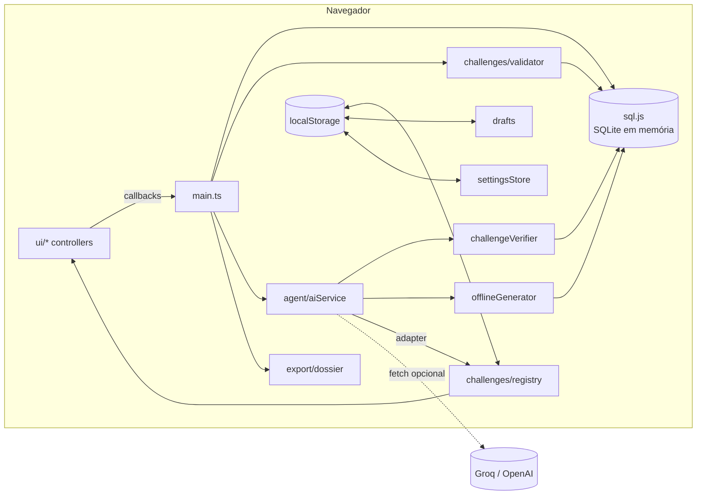
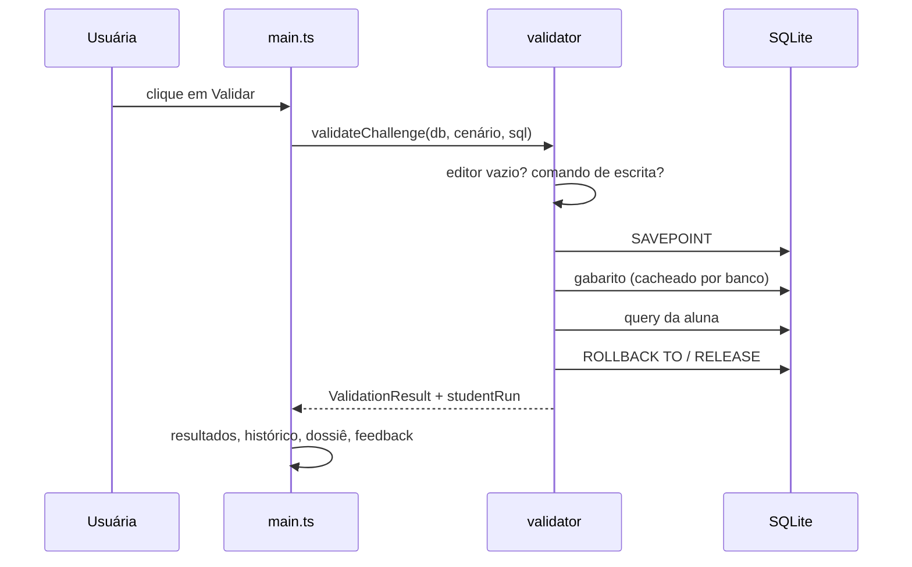

# AML SQL Lab — Documentação Técnica

Laboratório local de **SQL analítico para Prevenção à Lavagem de Dinheiro (PLD/AML)**. Todo o processamento acontece no navegador: o banco é um SQLite compilado para WebAssembly (sql.js), carregado com um dataset sintético de transações PIX. Não existe backend; a única chamada de rede opcional é ao provedor de LLM escolhido pela usuária (Groq ou OpenAI).

---

## Sumário

1. [Stack e requisitos](#1-stack-e-requisitos)
2. [Como executar](#2-como-executar)
3. [Estrutura de pastas](#3-estrutura-de-pastas)
4. [Arquitetura](#4-arquitetura)
5. [Banco de dados e dataset](#5-banco-de-dados-e-dataset)
6. [Execução segura de SQL](#6-execução-segura-de-sql)
7. [Motor de validação semântica](#7-motor-de-validação-semântica)
8. [Cenários investigativos](#8-cenários-investigativos)
9. [Agente Educador IA](#9-agente-educador-ia)
10. [Camada de interface](#10-camada-de-interface)
11. [Persistência no navegador](#11-persistência-no-navegador)
12. [Convenções de código](#12-convenções-de-código)
13. [Segurança e privacidade](#13-segurança-e-privacidade)
14. [Limitações conhecidas e próximos passos](#14-limitações-conhecidas-e-próximos-passos)

---

## 1. Stack e requisitos

| Item | Versão / escolha | Observação |
| --- | --- | --- |
| Build/dev server | Vite 8 | Sem plugins; `vite.config.ts` mínimo |
| Linguagem | TypeScript 7 (strict) | Sem framework de UI: DOM nativo |
| Estilos | Tailwind CSS v4 via CDN (`@tailwindcss/browser`) | Classes utilitárias direto no HTML/strings |
| Banco | sql.js 1.14 (SQLite → WebAssembly) | Banco **em memória**, recriado a cada carga |
| Rede | `fetch` nativo | Apenas para o LLM (opcional) |
| Runtime | Node.js LTS recente (20.19+ ou 22+) | Necessário só para desenvolvimento/build |

Única dependência de runtime: `sql.js`. Dependências de desenvolvimento: `typescript`, `vite`, `@types/sql.js`, `@types/node`.

---

## 2. Como executar

```bash
npm install          # instala dependências e copia o sql-wasm.wasm para public/ (postinstall)
npm run dev          # servidor de desenvolvimento em http://localhost:5173
npm run typecheck    # tsc --noEmit
npm run build        # typecheck + build de produção em dist/
npm run preview      # serve o dist/ localmente
npm run generate:dataset   # regenera src/data/dataset.json (determinístico)
```

Os scripts `predev`, `prebuild` e `postinstall` executam `scripts/copy-wasm.mjs`, que copia `node_modules/sql.js/dist/sql-wasm.wasm` para `public/`. Se o app mostrar **"WASM indisponível"**, rode `node scripts/copy-wasm.mjs`.

> Os avisos `Module "node:fs" has been externalized` no build vêm do próprio sql.js (código para Node que nunca roda no navegador) e são esperados.

---

## 3. Estrutura de pastas

```text
index.html                 Layout completo (header, 3 painéis, modal de IA)
scripts/
  copy-wasm.mjs            Copia o binário WASM do sql.js para public/
  generate-dataset.mjs     Gera o dataset sintético (PRNG com semente fixa)
src/
  main.ts                  Composição: inicializa os módulos e liga os eventos
  types/                   Tipos de domínio (Conta, TransacaoPix, Dataset) e d.ts do sql.js
  data/
    dataset.json           38 contas + 263 transações PIX (agosto/2026)
    dictionary.ts          Descrições de tabelas/colunas exibidas no Painel 1
  database/
    schema.ts              DDL (CREATE TABLE/INDEX)
    sqlite.ts              Carga do WASM, criação, seed e reset do banco
    introspection.ts       Leitura do schema (PRAGMA) e pré-visualização de tabelas
    safeQuery.ts           Bloqueio de escrita, execução isolada (SAVEPOINT), extração do ORDER BY
    sqlText.ts             Utilitários de texto SQL (remover comentários, comparar)
  challenges/
    scenarios.ts           Interface InvestigationScenario + 3 cenários base
    registry.ts            Catálogo único: cenários base + gerados (persistidos)
    validator.ts           Motor de validação semântica
    compare.ts             Comparação de células/colunas/linhas com tolerância
    sqlErrors.ts           Tradução de erros do SQLite para mensagens didáticas
    starterTemplate.ts     Template comentado inicial de cada desafio
    drafts.ts              Rascunhos por desafio
  agent/
    types.ts               GeneratedChallenge, AiSettings, foco/dificuldade
    settingsStore.ts       Provedores (Groq/OpenAI) e persistência da chave
    prompt.ts              System/user prompt (DDL + perfil do dataset + normas Bacen)
    challengeSchema.ts     JSON Schema e parser/validador da resposta do LLM
    challengeVerifier.ts   Sanity Check do gabarito no SQLite
    aiService.ts           Chamadas HTTP, autocorreção e fallback offline
    offlineGenerator.ts    8 templates parametrizados que geram desafios sem LLM
    challengeAdapter.ts    GeneratedChallenge → InvestigationScenario
  export/
    dossier.ts             Construção do dossiê em Markdown/CSV (funções puras)
  ui/
    dom.ts, format.ts      Helpers de DOM, escape de HTML e formatação pt-BR
    header.ts              Status do WASM, contadores, botão de IA, reset
    schemaPanel.ts         Painel 1: dicionário de dados
    editor.ts              Editor SQL, banner de confirmação, status
    editorSession.ts       Dono do texto do editor, rascunhos e troca de desafio
    queryHistory.ts        Gaveta com as últimas 10 execuções
    outputPanel.ts         Console de resultados
    resultTable.ts         Renderização tabular (moeda, datas, números)
    dossierExport.ts       Menu de exportação e download
    investigationPanel.ts  Painel 3: cenário, feedback, gabarito comentado
    agentPanel.ts          Controles do Agente Educador
    aiSettingsModal.ts     Modal BYOK (Groq/OpenAI)
    popover.ts             Comportamento comum de popovers (Esc, clique fora, ARIA)
```

---

## 4. Arquitetura

### 4.1 Padrão dos módulos de UI

Cada módulo de interface expõe uma função `initX(handlers)` que:

1. busca seus elementos por `id` (via `byId`, que falha cedo se o HTML divergir);
2. registra os listeners;
3. devolve um **controller** tipado (`setEnabled`, `showResults`, …).

Os módulos **não se conhecem**: toda a orquestração fica em `src/main.ts`, que recebe callbacks e chama controllers. A lógica de domínio (validação, geração, exportação) vive fora de `ui/` e não toca no DOM.

### 4.2 Visão geral



### 4.3 Fluxo de "Validar Desafio"



---

## 5. Banco de dados e dataset

### 5.1 Schema

Duas tabelas (ver `src/database/schema.ts`):

- **`contas`** — cadastro KYC: `id_conta` (PK, formato `C001`), `titular`, `tipo_pessoa` (`PF`/`PJ`), `documento` (único), `ocupacao`, `renda_mensal_declarada` (renda da PF ou faturamento da PJ), dados bancários (`banco_ispb`, `banco_nome`, `agencia`, `numero_conta`), chave PIX (`tipo_chave_pix`, `chave_pix`), `cidade`, `uf`, `data_abertura`.
- **`transacoes_pix`** — liquidações: `id_transacao` (PK), `id_conta_origem`/`id_conta_destino` (FK → `contas`), `valor` (> 0), `data_hora` (`TEXT 'YYYY-MM-DD HH:MM:SS'`, horário de Brasília), `tipo_chave_destino`, `chave_pix_destino`, `descricao`, `canal` (`APP`, `INTERNET_BANKING`, `API`).

`CHECK` constraints garantem domínios válidos e impedem origem = destino. Há índices por `data_hora`, `(id_conta_origem, data_hora)` e `(id_conta_destino, data_hora)`. `PRAGMA foreign_keys = ON` é aplicado na criação.

### 5.2 Dataset sintético

`src/data/dataset.json` é gerado por `scripts/generate-dataset.mjs` com PRNG `mulberry32` e semente fixa (`20260801`), portanto **é determinístico**: rodar o script de novo produz o mesmo arquivo. Período: 01 a 31/08/2026; limiar regulatório de referência: R$ 10.000. CPFs/CNPJs têm dígitos verificadores válidos, mas são aleatórios.

Além do "ruído" de transações legítimas, três tipologias estão plantadas:

| Tipologia | Contas | Padrão |
| --- | --- | --- |
| Smurfing | C025–C030, C038 | Contas recém-abertas enviam PIX entre R$ 9.700 e R$ 9.990 para uma PJ de baixo faturamento (C025), que repassa R$ 150 mil a uma holding |
| Burst | C031–C034 | Repasses via API, de madrugada, com intervalos < 60 s entre o mesmo par de contas (layering com retorno parcial) |
| Incompatibilidade patrimonial | C035, C036, … | Estudante, aposentada e MEI movimentam centenas de milhares de reais, muito acima da renda declarada |

### 5.3 Ciclo de vida

- `getDatabase()` cria o banco sob demanda (singleton por promessa) e faz o seed em uma transação.
- `resetDatabase()` fecha a instância e recria tudo a partir do JSON (botão **Resetar Banco**).
- O WASM é localizado por URL **absoluta** (`new URL(BASE_URL + arquivo, document.baseURI)`), porque o Emscripten resolveria caminhos relativos a partir do script do sql.js.

---

## 6. Execução segura de SQL

Existem dois caminhos com regras diferentes:

| Ação | Restrições | Efeito no banco |
| --- | --- | --- |
| **Executar Query** (Ctrl+Enter) | Nenhuma: aceita DML/DDL | Alterações persistem até o reset |
| **Validar Desafio** | Apenas `SELECT` / `WITH` / `VALUES` | Nenhum (rollback garantido) |

`src/database/safeQuery.ts`:

- `findForbiddenCommand(sql)` — remove comentários e literais (`stripCommentsAndLiterals`) e procura palavras-chave de escrita/controle (`INSERT`, `UPDATE`, `DELETE`, `DROP`, `ALTER`, `CREATE`, `ATTACH`, `PRAGMA`, `BEGIN`, `SAVEPOINT`, …). Também exige que **cada** statement comece com `SELECT`, `WITH` ou `VALUES`.
- `runIsolated(db, fn)` — executa dentro de `SAVEPOINT aml_readonly` e sempre faz `ROLLBACK TO` + `RELEASE` no `finally`. É uma segunda barreira: mesmo que algo escape do filtro léxico, nada persiste.
- `extractOrderBy(sql)` — encontra o `ORDER BY` **externo** contando a profundidade de parênteses (ignora `OVER (... ORDER BY ...)` e subconsultas) e remove `LIMIT`/`OFFSET`.

---

## 7. Motor de validação semântica

`validateChallenge(db, scenario, sql)` (em `src/challenges/validator.ts`) compara o **último** conjunto de resultados da aluna com o gabarito do cenário. O gabarito é executado uma vez por instância de banco e guardado num `WeakMap<Database, Map<id, resultado>>`.

### 7.1 Ordem das verificações

1. Editor vazio → erro.
2. Comando proibido → erro "Apenas consultas de leitura".
3. Erro do SQLite → mensagem didática (`sqlErrors.ts`) com a linha e o token destacados.
4. Zero linhas → **aviso** "Nenhuma evidência encontrada".
5. Menos colunas que o gabarito → erro "Colunas faltando".
6. Quantidade de linhas diferente → erro "Inconsistência no filtro", listando entidades ausentes/excedentes pela `colunaChave`.
7. Alguma coluna do gabarito sem correspondente:
   - se as linhas batem ignorando a ordem → **aviso** "ordenação divergente";
   - se as entidades diferem → erro "Entidades divergentes";
   - senão → **aviso** "Divergência nas métricas calculadas".
8. Tudo confere → **sucesso**, com observações de boas práticas (colunas extras, aliases diferentes, colunas em outra ordem).

### 7.2 Regras de comparação (`compare.ts`)

- **Tolerância numérica** de `0.01` (`NUMERIC_TOLERANCE`): valores monetários e razões com 2 casas não reprovam por arredondamento. Strings numéricas (`'10.50'`) são comparadas como números.
- **Mapeamento de colunas por conteúdo**: para cada coluna do gabarito, procura a coluna da aluna com os mesmos valores, priorizando a mesma posição, depois o mesmo nome (case-insensitive), depois qualquer coluna livre. Por isso **aliases diferentes são aceitos**.
- **Ordem das linhas** importa no caminho principal (o gabarito tem `ORDER BY`); `rowsMatchIgnoringOrder` serve para distinguir "dados certos, ordem errada" de "dados errados".
- `findKeyColumn` localiza a coluna-chave da aluna pelo nome ou pela maior sobreposição de valores.

### 7.3 Erros didáticos (`sqlErrors.ts`)

Mensagens do SQLite são classificadas em: erro de sintaxe, coluna inexistente, tabela inexistente, função não suportada, coluna ambígua, uso indevido de agregação/janela e SQL incompleto. Cada regra gera uma explicação e o destaque do token na linha correspondente.

---

## 8. Cenários investigativos

### 8.1 Contrato

Todo desafio — base ou gerado — implementa `InvestigationScenario` (`src/challenges/scenarios.ts`):

| Campo | Uso |
| --- | --- |
| `id`, `origem` (`base`/`ia`/`offline`), `modelo?` | Identificação e selo de origem |
| `titulo`, `enquadramento`, `dossie`, `objetivo` | Conteúdo exibido no Painel 3 |
| `colunasEsperadas`, `ordenacao` | Enunciado e template inicial |
| `dicaTexto`, `dicaSql` | "Dica de Sintaxe SQL" |
| `gabaritoSql` | Referência da validação e gabarito comentado |
| `colunaChave`, `rotuloEntidade` | Diferença de entidades nas mensagens |
| `dicasDivergencia` | Textos para excesso, falta, valores e ordenação |
| `resumirSucesso(gabarito)` | Mensagem e entidades exibidas no sucesso |

### 8.2 Cenários base

| id | Título | Colunas esperadas | Ordenação |
| --- | --- | --- | --- |
| `smurfing` | Smurfing para a receptora Aurora (C025) | `conta_origem, total_operacoes, valor_total` | `valor_total DESC` |
| `burst` | Burst / alta frequência em janela curta | `id_transacao, conta_origem, conta_destino, valor, data_hora, intervalo_segundos` | `conta_origem ASC, data_hora ASC` |
| `incompatibilidade` | Incompatibilidade patrimonial bruta | `id_transacao, conta_origem, titular, renda_mensal, valor, fator_incompatibilidade` | `fator_incompatibilidade DESC` |

### 8.3 Adicionar um cenário base

1. Acrescente um objeto ao array `SCENARIOS` em `scenarios.ts` respeitando a interface.
2. Garanta que `gabaritoSql` tenha `ORDER BY` determinístico (com desempate) e que `colunasEsperadas` reflita o `SELECT` final.
3. Rode `npm run typecheck` e valide o próprio gabarito pela interface (deve resultar em **sucesso**).

O `registry.ts` é a única fonte para o `<select>`; não é necessário alterar a UI.

---

## 9. Agente Educador IA

### 9.1 Provedores (BYOK)

| Provedor | Base URL | Modelo padrão | Prefixo da chave | Formato de saída |
| --- | --- | --- | --- | --- |
| Groq | `https://api.groq.com/openai/v1` | `llama-3.3-70b-versatile` | `gsk_` | `response_format: json_object` |
| OpenAI | `https://api.openai.com/v1` | `gpt-4o-mini` | `sk-` | `json_schema` estrito |

Ambos usam a API compatível com OpenAI (`POST /chat/completions`, `GET /models` para testar a conexão). O modelo é editável no modal (com sugestões).

### 9.2 Contrato gerado

```ts
interface GeneratedChallenge {
  id: string;
  titulo: string;
  tipologiaBacen: string;
  badgeEnquadramento: string;
  contexto: string;
  objetivo: string;
  dicaSql: string;
  solutionQuery: string;
  criteriosValidacao: { colunasEsperadas: string[]; descricaoSucesso: string };
}
```

### 9.3 Pipeline de geração (`aiService.generateChallenge`)


- **Prompt** (`prompt.ts`): inclui o DDL exato, um perfil calculado do banco (faixas de valor, canais, período, perfil de renda, linha de exemplo) e as diretrizes da **Circular Bacen 3.978/2020** e da **Carta Circular Bacen 4.001/2020**. As regras exigem SQLite estrito, funções suportadas, 1 a 150 linhas, `ORDER BY` externo com desempate, aliases em `snake_case` e comentários didáticos no gabarito.
- **Sanity Check** (`challengeVerifier.ts`): o gabarito precisa ser somente leitura, ter `ORDER BY` externo, executar sem erro (em `runIsolated`), retornar entre 1 e 150 linhas e ter a mesma quantidade de colunas que `colunasEsperadas`. Os nomes reais das colunas substituem os declarados. A razão da falha é escrita como instrução de correção para o modelo.
- **Autocorreção**: até 3 tentativas; a conversa acumula a resposta anterior e o erro do SQLite.
- **Timeout** de 60 s por requisição (`AbortSignal.timeout`) combinado com o cancelamento da usuária (`AbortSignal.any`). Cancelar **não** cai no offline.
- **Fallback offline** (`offlineGenerator.ts`): 8 templates parametrizados (horário atípico, fan-in em conta nova, conta de passagem, valores redondos, fracionamento, rajadas por hora, recebimentos vs. renda de PF, maior PIX vs. faturamento de PJ com `ROW_NUMBER`). Os parâmetros são sorteados e o resultado passa pelo mesmo Sanity Check.

### 9.4 Integração com o validador

`challengeAdapter.toScenario` converte o desafio gerado em `InvestigationScenario`: `ordenacao` vem de `extractOrderBy(solutionQuery)`, `colunaChave` é a primeira coluna esperada e as dicas de divergência são genéricas. Assim, desafios gerados usam exatamente o mesmo validador, a mesma tolerância e o mesmo gabarito comentado dos cenários base. O `registry.ts` guarda até 20 desafios gerados.

---

## 10. Camada de interface

### 10.1 Layout

- **Header**: status do WASM, contadores do dataset, **Configurar IA (Groq / OpenAI)** com indicador de chave (verde = salva, cinza = offline) e **Resetar Banco**.
- **Painel 1 — Dicionário de dados**: tabelas, colunas com PK/FK/NN e tipos, descrições, pré-visualização das 3 primeiras linhas; clicar numa coluna insere o nome no cursor do editor.
- **Painel 2 — Editor + resultados**: editor (Tab indenta, Ctrl+Enter executa; com texto selecionado, executa só a seleção), histórico, banner de confirmação e console de resultados com exportação.
- **Painel 3 — Investigação**: Agente Educador, seletor de cenários, dossiê do caso, dica, feedback da validação e gabarito comentado (liberado após a primeira tentativa).

### 10.2 Sessão do editor e rascunhos (`editorSession.ts`, `drafts.ts`)

- O editor tem um **dono** (`owner`): o cenário ao qual o texto pertence. Ele pode diferir do cenário selecionado enquanto uma confirmação está pendente.
- Cada edição agenda a gravação do rascunho do dono (debounce de 400 ms); a troca de cenário e o evento `pagehide` forçam a gravação.
- Rascunhos vazios, só com comentários ou idênticos ao template são descartados.
- Ao trocar de cenário:
  1. se o destino tem rascunho → restaura sem perguntar;
  2. se há query em andamento (texto real, diferente do último texto carregado e do template do dono) → banner **Substituir / Manter minha query**;
  3. caso contrário → carrega o template (`starterTemplate.ts`).
- Trocas sucessivas invalidam confirmações antigas (contador `switchToken`).
- Rascunhos de desafios removidos são apagados (`pruneDrafts`).
- O banner usa `aria-live` e **não rouba o foco** (para não atrapalhar a navegação por teclado no `<select>`).

### 10.3 Histórico (`queryHistory.ts`)

Últimas 10 execuções da sessão (em memória), incluindo validações. Queries repetidas sobem para o topo. Carregar um item usa `replaceSql`, que passa por `execCommand('insertText')` para preservar o **Ctrl+Z**.

### 10.4 Exportação do dossiê (`export/dossier.ts`, `ui/dossierExport.ts`)

- Habilitada somente após uma execução/validação **bem-sucedida**; um erro desabilita (evita exportar evidência antiga).
- **Markdown**: tabela de metadados (ID do caso, título, enquadramento BACEN, origem, data, tempo, linhas), objetivo, query em bloco `sql` e tabela de evidências.
- **CSV** (RFC 4180): BOM UTF-8, metadados em pares `campo,valor`, a query e as tabelas. Textos iniciados por `= + - @` recebem apóstrofo (proteção contra *CSV injection*).
- Nome do arquivo: `dossie-<id-do-caso>-<AAAAMMDD-HHmm>.md|csv`.

### 10.5 Acessibilidade

Regiões e painéis com `aria-labelledby`, status com `aria-live`, modal nativo `<dialog>` com `aria-describedby` no aviso de privacidade, popovers com `aria-expanded`/`aria-controls`, fechamento por Esc e retorno de foco, navegação por setas no histórico.

---

## 11. Persistência no navegador

| Chave do `localStorage` | Conteúdo | Módulo |
| --- | --- | --- |
| `aml-lab:ai-settings` | `{ provider, model, apiKey }` | `agent/settingsStore.ts` |
| `aml-lab:generated-challenges` | Até 20 desafios gerados (`StoredChallenge[]`) | `challenges/registry.ts` |
| `aml-lab:drafts` | `{ [idDoCenário]: sql }` | `challenges/drafts.ts` |

Tudo é lido de forma defensiva (JSON inválido é ignorado) e gravado com `try/catch` (quota ou storage indisponível não quebram a sessão). O banco SQLite **não** é persistido: cada carga parte do dataset original.

---

## 12. Convenções de código

- `tsconfig.json`: `strict`, `noUncheckedIndexedAccess`, `exactOptionalPropertyTypes`, `verbatimModuleSyntax`, `noUnusedLocals/Parameters`, `allowImportingTsExtensions` (imports com `.ts`).
- Imports de tipo com `import type`.
- HTML gerado por string sempre passa por `escapeHtml`; `formatInline` converte apenas `` `código` `` em `<code>`.
- Sem dependências de UI; nada de bibliotecas pesadas. Novas features seguem o padrão `initX` + controller.
- Comentários explicam restrições não óbvias; textos de interface em pt-BR.

---

## 13. Segurança e privacidade

- A chave de API fica **somente** no `localStorage` do navegador e é enviada apenas ao provedor escolhido, no header `Authorization`. Não há servidor do projeto.
- Qualquer script executado na mesma origem consegue ler o `localStorage`. Por isso todo conteúdo dinâmico (inclusive o que vem do LLM) é escapado antes de ir ao DOM. Recomenda-se usar chaves com limite de gastos.
- A validação nunca altera o banco (filtro léxico + `SAVEPOINT` revertido). "Executar Query" altera, de propósito, e o reset restaura.
- Dados 100% sintéticos.

---

## 14. Limitações conhecidas e próximos passos

- **Sem testes automatizados**: a verificação foi manual/no navegador. Candidatos naturais a testes unitários: `compare.ts`, `safeQuery.ts`, `challengeVerifier.ts`, `export/dossier.ts`, `drafts.ts`.
- O caminho com LLM real foi testado com `fetch` simulado; vale validar com chaves reais de Groq e OpenAI.
- O filtro de comandos é léxico; o `SAVEPOINT` é a garantia real de isolamento.
- O histórico é apenas da sessão (não persiste ao recarregar).
- O CSV usa vírgula como separador; o Excel em pt-BR pode exigir "Dados → De Texto/CSV" para separar colunas.
- O desafio gerado usa dicas de divergência genéricas (não específicas da tipologia).
