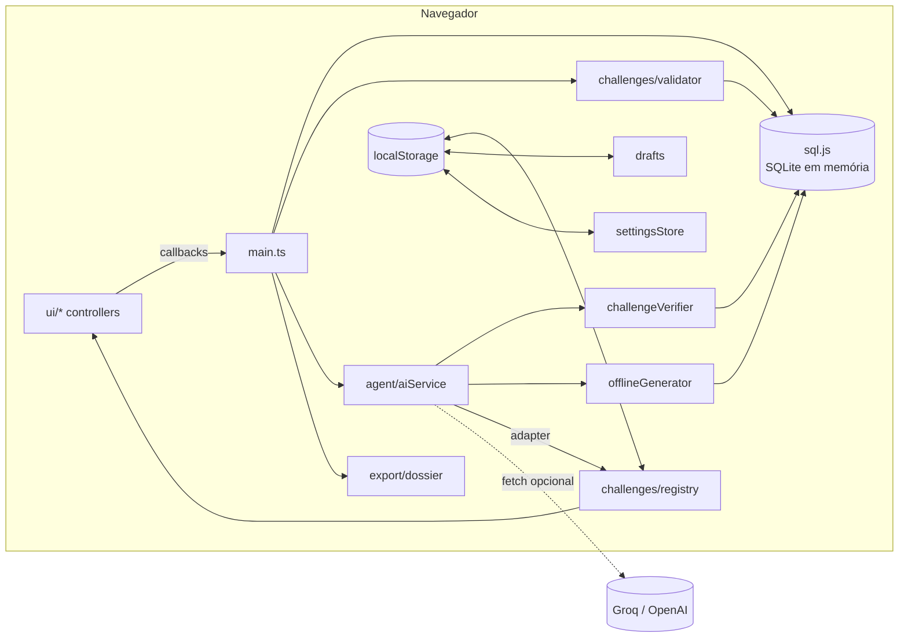
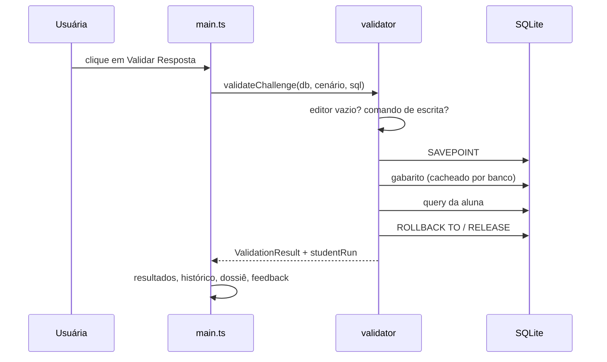
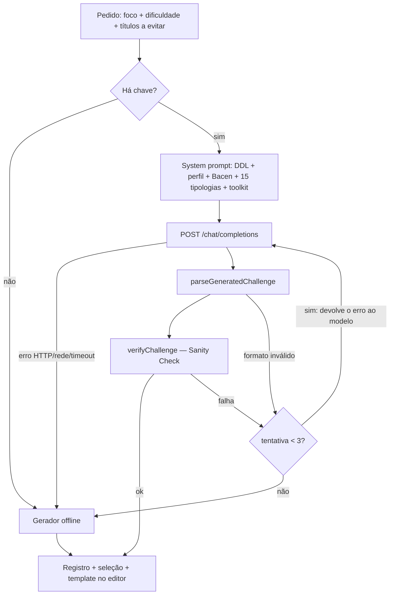

# AML SQL Lab — Documentação Técnica

Laboratório local de **SQL analítico para Prevenção à Lavagem de Dinheiro (PLD/AML)**. Todo o processamento acontece no navegador: o banco é um SQLite compilado para WebAssembly (sql.js), carregado com um dataset sintético de transações PIX. Não existe backend; a única chamada de rede opcional é ao provedor de LLM escolhido pela usuária (Groq ou OpenAI).

---

## Sumário

1. [Stack e requisitos](#1-stack-e-requisitos)
2. [Como executar](#2-como-executar)
3. [Estrutura de pastas](#3-estrutura-de-pastas)
4. [Arquitetura](#4-arquitetura)
5. [Banco de dados e dataset](#5-banco-de-dados-e-dataset)
6. [Execução segura de SQL](#6-execução-segura-de-sql)
7. [Motor de validação semântica](#7-motor-de-validação-semântica)
8. [Cenários investigativos](#8-cenários-investigativos)
9. [Agente Educador IA](#9-agente-educador-ia)
10. [Camada de interface](#10-camada-de-interface)
11. [Persistência no navegador](#11-persistência-no-navegador)
12. [Convenções de código](#12-convenções-de-código)
13. [Segurança e privacidade](#13-segurança-e-privacidade)
14. [Limitações conhecidas e próximos passos](#14-limitações-conhecidas-e-próximos-passos)

---

## 1. Stack e requisitos

| Item | Versão / escolha | Observação |
| --- | --- | --- |
| Build/dev server | Vite 8 | Sem plugins; `vite.config.ts` mínimo |
| Linguagem | TypeScript 7 (strict) | Sem framework de UI: DOM nativo |
| Estilos | Tailwind CSS v4 via CDN (`@tailwindcss/browser`) | Classes utilitárias direto no HTML/strings |
| Banco | sql.js 1.14 (SQLite → WebAssembly) | Banco **em memória**, recriado a cada carga |
| Rede | `fetch` nativo | Apenas para o LLM (opcional) |
| Runtime | Node.js LTS recente (20.19+ ou 22+) | Necessário só para desenvolvimento/build |

Única dependência de runtime: `sql.js`. Dependências de desenvolvimento: `typescript`, `vite`, `@types/sql.js`, `@types/node`.

---

## 2. Como executar

```bash
npm install          # instala dependências e copia o sql-wasm.wasm para public/ (postinstall)
npm run dev          # servidor de desenvolvimento em http://localhost:5173
npm run typecheck    # tsc --noEmit
npm run build        # typecheck + build de produção em dist/
npm run preview      # serve o dist/ localmente
npm run generate:dataset   # regenera src/data/dataset.json (determinístico)
```

Os scripts `predev`, `prebuild` e `postinstall` executam `scripts/copy-wasm.mjs`, que copia `node_modules/sql.js/dist/sql-wasm.wasm` para `public/`. Se o app mostrar **"WASM indisponível"**, rode `node scripts/copy-wasm.mjs`.

> Os avisos `Module "node:fs" has been externalized` no build vêm do próprio sql.js (código para Node que nunca roda no navegador) e são esperados.

---

## 3. Estrutura de pastas

```text
index.html                 Layout: navbar, duas colunas (desktop), briefing/dossiê mobile, gaveta do agente, modal de IA
scripts/
  copy-wasm.mjs            Copia o binário WASM do sql.js para public/
  generate-dataset.mjs     Dataset v1.4.0: PIX congelado (v1.3.0) + QSA/acessos/produtos (PRNG isolado)
src/
  main.ts                  Composição: inicializa os módulos e liga os eventos
  types/                   Tipos de domínio (Conta, TransacaoPix, SocioEmpresa, AcessoDigital, OperacaoProduto, Dataset) e d.ts do sql.js
  data/
    dataset.json           38 contas + PIX (ago/2026) + QSA, acessos e produtos (v1.4.0); regenerar após mudar o gerador
    dictionary.ts          Metadados das 5 tabelas (categoria, descrição, PK/FK, exemplos)
  database/
    schema.ts              DDL (CREATE TABLE/INDEX) — 5 tabelas; PRAGMA foreign_keys
    sqlite.ts              Carga do WASM, criação e seed (coleções novas aceitam `[]` se o JSON for antigo)
    introspection.ts       Leitura do schema (PRAGMA) e pré-visualização de tabelas
    safeQuery.ts           Bloqueio de escrita, execução isolada (SAVEPOINT), extração do ORDER BY
    cteInspector.ts        Completa um WITH sem SELECT externo para inspecionar a CTE
    sqlText.ts             Utilitários de texto SQL (remover comentários, comparar)
  challenges/
    scenarios.ts           Interface InvestigationScenario, níveis 0–5 e 41 cenários base
    twoPhase.ts            Decomposição pedagógica WITH → WHERE (N3, N4 e gerados)
    registry.ts            Catálogo único: cenários base + gerados (persistidos)
    validator.ts           Motor de validação semântica (orquestra compare + sqlErrors)
    compare.ts             Comparação com tolerância + esteira (FN/FP/fila) + banner de conformidade
    sqlErrors.ts           Erros do SQLite em vocabulário didático (5 tabelas; janela no WHERE)
    starterTemplate.ts     Esqueleto vazio comentado por nível (sem gabarito)
    drafts.ts              Rascunhos por desafio
  agent/
    types.ts               GeneratedChallenge, AiSettings, focos (incl. blocos A–D) e catálogo de 15 tipologias
    settingsStore.ts       Provedores (Groq/OpenAI) e persistência da chave
    prompt.ts              System/user prompt (DDL + perfil + normas Bacen + amarração por nível)
    difficultyToolkit.ts   Amarração Iniciante/Intermediário/Avançado + checagem do gabarito
    challengeSchema.ts     JSON Schema e parser/validador da resposta do LLM
    challengeVerifier.ts   Sanity Check do gabarito no SQLite
    aiService.ts           Chamadas HTTP, autocorreção e fallback offline
    offlineGenerator.ts    8 templates parametrizados que geram desafios sem LLM
    challengeAdapter.ts    GeneratedChallenge → InvestigationScenario
  export/
    dossier.ts             Construção do dossiê em Markdown/CSV (funções puras)
  services/
    progressService.ts     IDs concluídos (`keystone_completed_challenges`)
  ui/
    dom.ts, format.ts      Helpers de DOM, escape de HTML e formatação pt-BR
    navbar.ts              Progresso da trilha, Zerar, seletor de casos, popovers
    header.ts              Status Online/Offline do WASM
    layout.ts              Splitter desktop; overlay/gaveta mobile
    schemaPanel.ts         Dicionário no lugar da missão (insert sem fechar; Esc / Voltar)
    editor.ts              Editor SQL, banner de confirmação, `insertAtCursor` (Dicionário de Dados)
    editorSession.ts       Dono do texto do editor, rascunhos e troca de desafio
    queryHistory.ts        Popover com as últimas 10 execuções
    outputPanel.ts         Painel Resultados (banner, erro exclusivo, tabela, scroll)
    resultTable.ts         Renderização tabular (moeda, datas, números)
    dossierExport.ts       Menu de exportação e download
    investigationPanel.ts  Coluna "O que fazer": missão, dossiê, contrato, dica recolhida, briefing mobile
    agentPanel.ts          Gaveta do Agente Educador
    aiSettingsModal.ts     Modal BYOK (Groq/OpenAI)
    onboardingTour.ts      Tour ancorado (Entenda o Laboratório)
    popover.ts             Comportamento comum de popovers (Esc, clique fora, ARIA; começam `hidden`)
```

---

## 4. Arquitetura

### 4.1 Padrão dos módulos de UI

Cada módulo de interface expõe uma função `initX(handlers)` que:

1. busca seus elementos por `id` (`byId` falha cedo; o painel de investigação e a navbar tratam ausência de nós de forma defensiva);
2. registra os listeners;
3. devolve um **controller** tipado (`setEnabled`, `showResults`, …).

Os módulos **não se conhecem**: toda a orquestração fica em `src/main.ts`, que recebe callbacks e chama controllers. A lógica de domínio (validação, geração, exportação) vive fora de `ui/` e não toca no DOM.

### 4.2 Visão geral



### 4.3 Fluxo de "Validar Desafio"



---

## 5. Banco de dados e dataset

### 5.1 Schema

Cinco tabelas **fixas** (ver `src/database/schema.ts`). O agente de IA **não** altera o DDL: só gera desafios contra este schema.

- **`contas`** — cadastro KYC: `id_conta` (PK, formato `C001`), `titular`, `tipo_pessoa` (`PF`/`PJ`), `documento` (único), `ocupacao`, `renda_mensal_declarada` (renda da PF ou faturamento da PJ), dados bancários (`banco_ispb`, `banco_nome`, `agencia`, `numero_conta`), chave PIX (`tipo_chave_pix`, `chave_pix`), `cidade`, `uf`, `data_abertura`, **`eh_pep`** (0/1) e **`cargo_pep`**. PEP plantado de forma determinística: **C013** (Deputado Estadual) e **C004** (Prefeito).
- **`transacoes_pix`** — liquidações: `id_transacao` (PK), `id_conta_origem`/`id_conta_destino` (FK → `contas`), `valor` (> 0), `data_hora` (`TEXT 'YYYY-MM-DD HH:MM:SS'`, horário de Brasília), `tipo_chave_destino`, `chave_pix_destino`, `descricao`, `canal` (`APP`, `INTERNET_BANKING`, `API`).
- **`socios_empresas`** — QSA: `id_socio` (PK), `id_conta_empresa` (FK → `contas`, `ON DELETE CASCADE`), `cnpj_empresa`, `cpf_socio`, `nome_socio`, `percentual_participacao` (0 exclusive a 100], `eh_administrador` (0/1), `data_entrada`. Índices por conta e CPF.
- **`acessos_digitais`** — telemetria: `id_acesso` (PK), `id_conta` (FK, CASCADE), `device_id`, `ip`, `geolocalizacao_cidade`/`uf`, `latitude`/`longitude` (nullable), `sucesso` (0/1), `data_hora`. Índices por `(id_conta, data_hora)` e `device_id`.
- **`operacoes_produtos`** — aportes: `id_operacao` (PK), `id_conta` (FK, CASCADE), `tipo_produto` (`CONSORCIO_LANCE`, `CDB_LIQUIDEZ_DIARIA`, `PREVIDENCIA_VGBL`, `FUNDOS_RENDA_FIXA`), `valor_aporte` (> 0), `forma_liquidacao` (`ESPECIE`, `PIX`, `TED`, `SALDO_CONTA`), `status_contemplacao` (0/1), `data_operacao`. Índices por conta e liquidação.

`CHECK` constraints garantem domínios válidos, impedem origem = destino no PIX e amarram PEP: `eh_pep IN (0, 1)` e, se `eh_pep = 0`, então `cargo_pep` é NULL; se `eh_pep = 1`, `cargo_pep` é obrigatório. Há índices PIX por `data_hora`, `(id_conta_origem, data_hora)` e `(id_conta_destino, data_hora)`. `PRAGMA foreign_keys = ON` é aplicado na criação.

O dicionário (`dictionary.ts`) classifica as tabelas em **Cadastral & Societário**, **Transacional**, **Segurança & Telemetria** e **Investimentos & Produtos**, com descrição, exemplo e selos PK/FK usados no Dicionário de Dados.

### 5.2 Dataset sintético

`src/data/dataset.json` (versão de metadados **1.4.0**) é gerado por `scripts/generate-dataset.mjs` com PRNG `mulberry32` e semente fixa (`20260801`), portanto **é determinístico**: rodar o script de novo produz o mesmo arquivo. Período: 01 a 31/08/2026; limiar regulatório de referência: R$ 10.000. CPFs/CNPJs têm dígitos verificadores válidos, mas são aleatórios. O status PEP **não** consome o PRNG (mapa fixo `CARGO_PEP`). Escalada PEP, coação noturna, ATO e valores redondos no PIX são gravados **depois** dos laços aleatórios, com `ts(...)` fixos e **sem** `rand()`, para não alterar a sequência das tipologias já homologadas (congeladas como na v1.3.0).

A extensão **1.4.0** (QSA, acessos digitais, produtos) usa PRNG **isolado** depois do bloco PIX, para não embaralhar as contas/transações já validadas.

Além do "ruído" de transações legítimas, as tipologias plantadas são:

| Tipologia | Contas | Padrão |
| --- | --- | --- |
| Smurfing | C025–C030, C038 | Contas recém-abertas enviam PIX entre R$ 9.700 e R$ 9.990 para uma PJ de baixo faturamento (C025), que repassa R$ 150 mil a uma holding |
| Burst | C031–C034 | Repasses via API, de madrugada, com intervalos < 60 s entre o mesmo par de contas (layering com retorno parcial) |
| Incompatibilidade patrimonial | C035, C036, C037, C038 | Estudante, aposentada e MEI movimentam centenas de milhares de reais, muito acima da renda declarada |
| PEP (KYC + escalada) | C013, C004 | Pessoa Exposta Politicamente: Deputado Estadual (C013, Brasília) e Prefeito (C004, Curitiba). C013 origina, em **27/08**, três PIX a C022 (R$ 7.200, R$ 7.500 e R$ 6.800) após histórico compatível; a soma móvel das 3 supera R$ 20 mil e fica abaixo de R$ 25 mil (não entra no gabarito 4.2). |
| Coação noturna | C005, C032 | Advogada (rotina diurna) envia R$ 8.500 (23:42) e R$ 9.200 (01:50) à intermediadora C032 |
| Account takeover (PIX) | C001, C034 | Micro-PIX de R$ 1,50 e R$ 2,00 e, 4 min depois, R$ 15.000 via API |
| Valores redondos | C009, C007, C010, C001 | Múltiplos de R$ 5.000 (R$ 20.000, R$ 10.000, R$ 5.000 e o ATO de R$ 15.000), cada um abaixo do corte da janela móvel (R$ 25 mil) |
| QSA / UBO | C025, C038, demais PJ | Aurora (C025): laranjas C026/C027 com 1% e **Cláudio Henrique Vilela 98% + administrador**. Holding C038: UBO offshore 90%. Outras PJ com quadro familiar. |
| Telemetria ATO | C001 | Login falho + sessão ok em **Manaus** (`DEV-C001-ATO`) imediatamente antes do PIX alto; demais contas com 2 acessos habituais na cidade KYC |
| Produtos / espécie | C025 e outras | Lance de consórcio contemplado em espécie (O001, R$ 85 mil na Aurora); demais aportes (CDB, VGBL, fundos, lance não contemplado) para ruído |

### 5.3 Ciclo de vida

- `getDatabase()` cria o banco sob demanda (singleton por promessa) e faz o seed em uma transação. Não há `resetDatabase` na UI: recarregar a página recria o singleton.
- O WASM é localizado por URL **absoluta** (`new URL(BASE_URL + arquivo, document.baseURI)`), porque o Emscripten resolveria caminhos relativos a partir do script do sql.js.

---

## 6. Execução segura de SQL

Existem dois caminhos com regras diferentes:

| Ação | Restrições | Efeito no banco |
| --- | --- | --- |
| **Rodar Teste** (Ctrl+Enter) | Nenhuma: aceita DML/DDL | Alterações persistem até recarregar a página |
| **Validar Desafio** | Apenas `SELECT` / `WITH` / `VALUES` | Nenhum (rollback garantido) |

`src/database/safeQuery.ts`:

- `findForbiddenCommand(sql)` — remove comentários e literais (`stripCommentsAndLiterals`) e procura palavras-chave de escrita/controle (`INSERT`, `UPDATE`, `DELETE`, `DROP`, `ALTER`, `CREATE`, `ATTACH`, `PRAGMA`, `BEGIN`, `SAVEPOINT`, …). Também exige que **cada** statement comece com `SELECT`, `WITH` ou `VALUES`.
- `runIsolated(db, fn)` — executa dentro de `SAVEPOINT aml_readonly` e sempre faz `ROLLBACK TO` + `RELEASE` no `finally`. É uma segunda barreira: mesmo que algo escape do filtro léxico, nada persiste.
- `extractOrderBy(sql)` — encontra o `ORDER BY` **externo** contando a profundidade de parênteses (ignora `OVER (... ORDER BY ...)` e subconsultas) e remove `LIMIT`/`OFFSET`.

---

## 7. Motor de validação semântica

`validateChallenge(db, scenario, sql)` (em `src/challenges/validator.ts`) compara o **último** conjunto de resultados da aluna com o gabarito do cenário. O gabarito é executado uma vez por instância de banco e guardado num `WeakMap<Database, Map<id, resultado>>`.

### 7.1 Ordem das verificações

1. Editor vazio → erro.
2. Comando proibido → erro "Apenas consultas de leitura".
3. Erro do SQLite → mensagem didática (`sqlErrors.ts`) com a linha e o token destacados. **Prioridade:** Window Function no `WHERE`/`HAVING` (ver 7.3). No UI, o painel Resultados mostra **somente** o card de erro (sem tabela vazia residual).
4. Zero linhas → **erro** de falsos negativos (`describeRowAudit` em `compare.ts`).
5. Quantidade de **linhas** diferente → **erro** de esteira (FN, FP ou ambos), com IDs/contas da `colunaChave`. `dicasDivergencia` em `details`.
6. Quantidade de **colunas** diferente (faltou ou sobrou dimensão) → **`quase_la`**. Não se usa `quase_la` quando a matriz de dados já confere.
7. Matriz de dados: sucesso se `rowsMatchPositionally` **ou** `mapColumnsByContent` completo **ou** `rowsMatchIgnoringOrder` (`compare.ts`). Aliases e permutação física de colunas **não** reprovam.
8. Dados que não mapeiam → **erro** (entidades divergentes ou métricas fora da tolerância 0,01).
9. Sucesso → título `formatComplianceBanner`, chips no `outputPanel`, `avisoConformidade` (`composeAvisoGovernanca`) se o contrato de nomes ou a ordem física divergir. `ordenacao` de linhas pode ir em `details` (fila de priorização), sem mudar o status.

### 7.2 Comparação e modo Investigador (`compare.ts`)

Comparação de células:

- **Tolerância numérica** de `0.01` (`NUMERIC_TOLERANCE`): valores monetários e razões com 2 casas não reprovam por arredondamento. Strings numéricas (`'10.50'`) são comparadas como números.
- **Aprovação pela matriz**: o status `success` depende dos valores (células normalizadas), não dos nomes em `columns`. Caminhos: match posicional, mapeamento por conteúdo, ou conjunto de linhas ignorando ordem.
- **Aliases / ordem de colunas**: `avisoConformidade` no card verde (`Dica de Governança`). Nomes iguais ao contrato (case-insensitive) e `mapping[j] === j` omitem o aviso. Famílias de sinónimos PLD ficam em `ALIAS_FAMILIES`.
- **Ordem das linhas** (`ORDER BY`) **não** reprova; `rowsMatchIgnoringOrder` evita tratar permutação de linhas como dado errado. A nota de fila usa `describePrioritizationMismatch`.
- `findKeyColumn` localiza a coluna-chave da aluna pelo nome ou pela maior sobreposição de valores.

Mensagens de auditoria (funções `describeFalseNegatives`, `describeFalsePositives`, `describeRowAudit`, `describePrioritizationMismatch`):

| Situação | Vocabulário | Conteúdo |
| --- | --- | --- |
| Linhas a menos (e/ou chaves do gabarito ausentes) | Falsos negativos / alertas não capturados | Quantas transações a esteira capturou, quantos alertas legítimos escaparam, exemplos (`C031`, `id_transacao`…) e convite a revisar data, intervalo em segundos e limiares de valor |
| Linhas a mais (e/ou chaves extras) | Falsos positivos / ruído operacional | Quantos ruídos, exemplos das entidades excedentes, convite a completar o `WHERE` externo ou a janela temporal |
| Mesmo conjunto, ordem de **linhas** diferente | Nota no sucesso (fila de priorização) | Cita `ORDER BY` esperado (`scenario.ordenacao`); status permanece `success` |
| Mesmo conjunto, aliases ou ordem de **colunas** diferentes | `avisoConformidade` | Textos de mercado/schema e layout CSV/Parquet (`composeAvisoGovernanca`) |

Se faltam **e** sobram entidades, as duas explicações são concatenadas.

No **sucesso**, `computeComplianceMetrics(X, X, 0)` alimenta `formatComplianceBanner`. O `ValidationResult` leva `compliance` e, se couber, `avisoConformidade` para o `outputPanel`. `resumirSucesso` permanece em `message`.

### 7.3 Erros didáticos (`sqlErrors.ts`)

`describeSqlError(error, sql)` classifica a mensagem do SQLite. **Antes** das regras genéricas, intercepta janela no filtro:

- texto do SQLite: `misuse of window function`, `window functions not allowed in WHERE` (e variantes com `HAVING`);
- **ou** a query, após `maskSql`, contém `WHERE`/`HAVING` seguido de `OVER (`, `LAG(`, `LEAD(`, `ROW_NUMBER(`, `RANK(`, `DENSE_RANK(`, `NTILE(`.

Nesses casos o título é **⚠️ Ordem de Execução do Compilador SQL**: o `WHERE` corre **antes** de o `SELECT` materializar Window Functions; a métrica deve ir no `WITH envelope_metricas AS (...)` (Fase 1) e o corte no `WHERE` externo (Fase 2). O destaque aponta o token (`LAG`, `OVER`, etc.).

Demais regras: erro de sintaxe, coluna inexistente, tabela inexistente (lista as **cinco** tabelas), função não suportada, coluna ambígua, uso indevido de **agregação** (`HAVING` após `GROUP BY`) e SQL incompleto.

---

## 8. Cenários investigativos

### 8.1 Contrato

Todo desafio — base ou gerado — implementa `InvestigationScenario` (`src/challenges/scenarios.ts`):

| Campo | Uso |
| --- | --- |
| `id`, `origem` (`base`/`ia`/`offline`), `modelo?` | Identificação e selo de origem |
| `titulo`, `enquadramento`, `dossie`, `objetivo` | Missão (linguagem de negócio de PLD/FT, **sem** cláusulas SQL) + aba Dossiê; `objetivo` não é despejado na aba de colunas. O card **Sua Missão** mostra a primeira frase (`investigationPanel.missionLine` / `starterTemplate`), ignorando pontos de milhar (`9.700`) |
| `colunasEsperadas`, `ordenacao` | Objetivo de negócio derivado + spoiler de aliases; template inicial |
| `dicaTexto`, `dicaSql` | "Dica de Sintaxe SQL" |
| `decomposicao?` | Card **Decomposição em 2 Fases** (N3/N4 explícito; gerados inferem via `twoPhase.ts`) |
| `gabaritoSql` | Referência da validação e gabarito comentado |
| `colunaChave`, `rotuloEntidade` | Diferença de entidades nas mensagens de esteira |
| `dicasDivergencia` | Dicas SQL em `details` (excesso, falta, valores, ordenação); o título/`message` da divergência de volume vem de `compare.ts` |
| `resumirSucesso(gabarito)` | Narrativa e entidades no sucesso; o **título** verde vem de `formatComplianceBanner` |

### 8.2 Trilha pedagógica por níveis

Todo cenário tem `nivel: TrailLevel` (`0 | 1 | 2 | 3 | 4 | 5`). `TRAIL_LEVELS` guarda o título e a técnica-alvo; `TRAIL_ORDER` (interno) é a ordem dos grupos. O `<select>` monta um `<optgroup>` por nível. O filtro **Todos / Iniciante (0–1) / Intermediário (2–3) / Avançado (4–5)** restringe os grupos visíveis.

| Nível | Tema | Técnica-alvo |
| --- | --- | --- |
| 0 | Fundamentos de Consulta | `SELECT`, `FROM`, `WHERE`, `ORDER BY`, `GROUP BY` |
| 1 | Fundamentos de Agregação | `GROUP BY`, `HAVING`, `JOIN` e limiares |
| 2 | Cruzamentos Cadastrais e Relações Societárias | `JOIN`, `LEFT JOIN` e cadastro duplo |
| 3 | Janelas Temporais e Anomalias Transacionais | `strftime`, `date()`, `unixepoch`, `HAVING` sobre renda |
| 4 | Funções de Janela | `ROW_NUMBER`, `LAG`, `SUM OVER`, CTE em duas fases |
| 5 | Investigações Avançadas Bacen | UBO/PEP, dwell time, telemetria, triangulação, dossiê COAF |

Desafios gerados (`origem` `ia`/`offline`) recebem `nivel` via `challengeAdapter.scenarioNivel` (campo `nivel`, id ou inferência do SQL) — **não** são forçados ao nível 5.

### 8.3 Cenários base

**41** itens em `CATALOG` (`DEFAULT_SCENARIO_ID` = `cadastro-listagem`). IDs por nível:

| Nível | ids |
| --- | --- |
| 0 | `cadastro-listagem`, `triagem-pep`, `pix-alto-valor`, `baixa-renda-pf`, `volumetria-remetente`, `capilaridade-destinatarios` |
| 1 | `smurfing`, `alta-recorrencia`, `concentracao-creditos`, `fracionamento-limiar`, `matriz-criticidade`, `incompatibilidade` |
| 2 | `enriquecimento-alto-valor`, `quadro-societario-admin`, `contas-dormentes`, `volumetria-pep`, `fluxos-intrabanco`, `pico-diario` |
| 3 | `limiar-noturno`, `liquidacoes-fim-de-semana`, `volume-desproporcional-renda`, `rajada-mesma-data`, `telemetria-ato-janela`, `burst`, `noturno-coacao` |
| 4 | `sequenciamento-cronologico`, `ultima-movimentacao`, `intervalo-entre-disparos`, `montante-acumulado`, `salto-variacao-consecutiva`, `conta-aquecida`, `janela-movel`, `pep-escalada` |
| 5 | `ubo-pep-credito`, `conta-passagem-dwell`, `vetor-geografico-impossivel`, `triangulacao-societaria`, `dossie-coaf-pj`, `ubo-aurora`, `ato-dispositivo`, `consorcio-especie` |

Colunas e `ordenacao` de cada caso estão no objeto em `scenarios.ts`. Notas de desenho dos casos-âncora:

- **`pico-diario`** usa o dia de rajada (18/08), em que C031 e C032 enviam 9 e 7 PIX. C031 tem dois PIX empatados em R$ 4.990, então o desempate `data_hora ASC` é obrigatório para o resultado ser determinístico. `COUNT`/`SUM` com `OVER (PARTITION BY …)` mostram que janelas agregam sem colapsar linhas.
- **`conta-aquecida`** combina quatro regras no `WHERE` externo: 1 a 3 PIX anteriores, `valor >= 10 × média histórica` (frame `ROWS BETWEEN UNBOUNDED PRECEDING AND 1 PRECEDING`), `valor >= 5000` e intervalo de até 10 dias desde o PIX anterior (`LAG`). O resultado são as quatro contas laranja que fazem PIX de teste (C026, C027, C035, C036). Relaxar o critério de histórico faz aparecer falsos positivos legítimos (C006, C016).
- **`janela-movel`** carimba `SUM(valor) OVER (PARTITION BY id_conta_origem ORDER BY data_hora ROWS BETWEEN 2 PRECEDING AND CURRENT ROW)` e corta `acumulado_movel_3 >= 25000` no `WHERE` externo (marcadores FASE 1 / FASE 2). No dataset atual o gabarito devolve **18 linhas** (estruturação C026–C029, circuito C035–C038, PIX isolados altos como C025/C021/C023).
- **`pep-escalada`** faz `JOIN` `transacoes_pix`/`contas` no envelope, carimba a mesma janela de 3 PIX como `acumulado_movel_pep` e no inspetor exige `eh_pep = 1` e `acumulado_movel_pep > 20000`. O recorte plantado é C013 (Deputado Estadual) em 27/08; valores individuais < R$ 10 mil e soma móvel < R$ 25 mil para não colidir com smurfing, burst, incompatibilidade, conta-aquecida nem 4.2.
- **`noturno-coacao`** carimba `hora_transacao` com `CAST(strftime('%H', data_hora) AS INTEGER)` e corta `valor >= 5000` e `(hora >= 20 OR hora < 6)`. Inclui C005→C032 (R$ 8.500 / R$ 9.200) e originações noturnas ≥ R$ 5 mil da cadeia burst (C032).
- **`ubo-aurora`** filtra `socios_empresas` da C025 com `percentual_participacao >= 25` e `eh_administrador = 1`. O gabarito depende de Cláudio (98%) estar marcado como administrador no JSON 1.4.0.
- **`ato-dispositivo`** cruza `acessos_digitais` (login ok, cidade ≠ KYC) com PIX de origem `valor >= 10000` em janela de 0 a 900 s (`unixepoch`).
- **`consorcio-especie`** recorta `operacoes_produtos` com `tipo_produto = 'CONSORCIO_LANCE'`, `forma_liquidacao = 'ESPECIE'` e `status_contemplacao = 1` (O001 na Aurora; O002 não contemplado fica de fora).
- **`objetivo`** de todos os casos base descreve só a regra investigativa (faixas, recorrência, janelas, PEP, UBO, espécie). A sintaxe (`HAVING`, `LAG`, `ROW_NUMBER`, aliases) permanece em `dicaTexto` / `dicaSql` / `gabaritoSql`.

### 8.4 Adicionar um cenário base

1. Acrescente um objeto ao array `CATALOG` em `scenarios.ts` respeitando a interface e definindo `nivel`. `SCENARIOS` é o catálogo ordenado por nível (ordenação estável).
2. `colunasEsperadas` deve refletir o `SELECT` final. `ORDER BY` no gabarito é pedagógico (não é critério de aprovação).
3. Rode `npm run typecheck` e valide o próprio gabarito pela interface (deve resultar em **sucesso**).

O `registry.ts` é a única fonte para o `<select>`; não é necessário alterar a UI.

---

## 9. Agente Educador IA

### 9.1 Provedores (BYOK)

| Provedor | Base URL | Modelo padrão | Prefixo da chave | Formato de saída |
| --- | --- | --- | --- | --- |
| Groq | `https://api.groq.com/openai/v1` | `openai/gpt-oss-120b` | `gsk_` | `response_format: json_object` |
| OpenAI | `https://api.openai.com/v1` | `gpt-4o-mini` | `sk-` | `json_schema` estrito |

Ambos usam a API compatível com OpenAI (`POST /chat/completions`, `GET /models` para testar a conexão). O modelo é editável no modal (com sugestões).

### 9.2 Contrato gerado

```ts
interface GeneratedChallenge {
  id: string;
  titulo: string;
  tipologiaBacen: string;
  badgeEnquadramento: string;
  contexto: string;
  objetivo: string;
  dicaSql: string;
  solutionQuery: string;
  criteriosValidacao: { colunasEsperadas: string[]; descricaoSucesso: string };
}
```

### 9.3 Pipeline de geração (`aiService.generateChallenge`)



- **Prompt** (`prompt.ts` + `difficultyToolkit.ts` + `types.ts`): `buildSystemPrompt(db, difficulty)` **exige** o nível e injeta o toolkit como **PRIORIDADE MÁXIMA**. O system prompt inclui o **catálogo de 15 tipologias** (`ADVANCED_TYPOLOGY_CATALOG`: blocos A coação/furto, B invasão digital, C laranjas/mulas, D Carta Circular 4.001) com cláusulas SQL de corte. O user prompt injeta `FOCUS_TYPOLOGY_GUIDE[focus]`. Colunas reais (`eh_pep`, `cargo_pep`, …) e dialeto SQLite entram no contexto. Regras de ferramental:

| Nível | Obrigatório | Proibido | Foco |
| --- | --- | --- | --- |
| Iniciante | `GROUP BY`, `HAVING`, agregações (`COUNT`/`SUM`/`AVG`/`MAX`/`MIN`), `WHERE` (`BETWEEN`, `IN`, limiares) | `WITH` e Window Functions (`OVER`, `LAG`, `ROW_NUMBER`…) | Volumetria e fracionamento básico |
| Intermediário | `WITH` + `ROW_NUMBER()`/`RANK()`/`DENSE_RANK() OVER (...)` e corte posicional no SELECT externo | Resolver só com `GROUP BY`/`HAVING`; `LAG`/`LEAD` (reservados ao avançado) | Desduplicação, maior evento por conta, pico relativo |
| Avançado | `WITH` + `LAG()`/`LEAD()` **ou** ≥ 2 janelas `OVER`; corte no `WHERE` externo | `SELECT` plano sem CTE; só agregação como solução principal | Burst, mudança de comportamento, intervalo entre PIX consecutivos |

Intermediário e Avançado: `solutionQuery` na ordem do compilador, com comentários `-- FASE 1: O ENVELOPE ANALÍTICO` (carimbo linha a linha) e `-- FASE 2: O INSPETOR DE RISCO` (`WHERE` de corte + `ORDER BY`). Esqueleto em `COMPILER_SKELETON` (`difficultyToolkit.ts`). Iniciante: `SELECT` plano, comentários em `WHERE`/`GROUP BY`/`HAVING`. Demais regras: 1 a 150 linhas, `ORDER BY` externo com desempate, aliases `snake_case`.
- **Sanity Check** (`challengeVerifier.ts`): somente leitura, `ORDER BY` externo, `checkDifficultyToolkit` **quando** `difficulty` é passado (pipeline LLM em `aiService`; o gerador offline **não** passa o nível, para os templates sem marcadores FASE 1/2 continuarem válidos). Executa em `runIsolated`, 1–150 linhas, mesmas colunas que `colunasEsperadas`. Nomes reais substituem os declarados. A razão da falha volta ao modelo como correção.
- **Autocorreção**: até 3 tentativas; a conversa acumula a resposta anterior e o erro do SQLite.
- **Timeout** de 60 s por requisição (`AbortSignal.timeout`) combinado com o cancelamento da usuária (`AbortSignal.any`). Cancelar **não** cai no offline.
- **Fallback offline** (`offlineGenerator.ts`): 8 templates dos **focos clássicos**. Os blocos A–D (`coacao_fisica`, `invasao_digital`, `laranjas_mulas`, `bacen_avancado`) são cobertos pela LLM; offline nesses focos pode não achar template.

### 9.4 Integração com o validador

`challengeAdapter.toScenario` converte o desafio gerado em `InvestigationScenario` com `nivel` inferido (`ch.nivel`, id ou SQL). `ordenacao` vem de `extractOrderBy(solutionQuery)`, `colunaChave` é a primeira coluna esperada e as dicas de divergência são genéricas. O mesmo validador dos casos base se aplica. O `registry.ts` guarda até 20 desafios gerados.

---

## 10. Camada de interface

### 10.1 Layout

- **Navbar**: status Online/Offline, progresso + **Zerar**, filtro da trilha, seletor (default `cadastro-listagem`), **Agente IA**, **Entenda o Laboratório**.
- **Coluna esquerda — O que fazer** (`investigationPanel.ts` + splitter em `layout.ts`): missão, dossiê, **Consultar Tabelas Disponíveis**, contrato de aliases, `<details>` **Revelar Dica de SQL** (fechado), gabarito após a 1ª validação. `#workspace-gutter` usa `hidden md:block`. Mobile: `#mobile-briefing` empilhado (badge → título → missão) e modal `#mobile-dossier-dialog`.
- **Coluna direita — editor e resultados**: `Rodar Teste`, `Validar Resposta`, restaurar modelo, histórico. Sucesso: card verde + chips; `avisoConformidade` no bloco **Dica de Governança**. Popovers nascem com `hidden`.
- **Dicionário** (`schemaPanel.ts` + `#schema-drawer`): substitui `#investigation-mission-view` na coluna esquerda (`dataset.view = schema`). Lista das 5 tabelas + inspetor. Filtro `#schema-filter`. Insert via `data-insert`. Fecha com **← Voltar para a Missão** ou **Esc**. No mobile o painel ocupa overlay (`data-overlay`).
- **Gaveta Agente**: geração de desafios e atalho para o modal BYOK.

### 10.2 Sessão do editor e rascunhos (`editorSession.ts`, `drafts.ts`)

- O editor tem um **dono** (`owner`): o cenário ao qual o texto pertence. Ele pode diferir do cenário selecionado enquanto uma confirmação está pendente.
- Cada edição agenda a gravação do rascunho do dono (debounce de 400 ms); a troca de cenário e o evento `pagehide` forçam a gravação.
- Rascunhos vazios, só com comentários ou idênticos ao template são descartados.
- Ao trocar de cenário:
  1. se o destino tem rascunho → restaura sem perguntar;
  2. se há query em andamento (texto real, diferente do último texto carregado e do template do dono) → banner **Substituir / Manter minha query**;
  3. caso contrário → carrega o template (`starterTemplate.ts`).
- Trocas sucessivas invalidam confirmações antigas (contador `switchToken`).
- Rascunhos de desafios removidos são apagados (`pruneDrafts`).
- O banner usa `aria-live` e **não rouba o foco** (para não atrapalhar a navegação por teclado no `<select>`).

### 10.3 Histórico (`queryHistory.ts`)

Últimas 10 execuções da sessão (em memória), incluindo validações. Queries repetidas sobem para o topo. Carregar um item usa `replaceSql`, que passa por `execCommand('insertText')` para preservar o **Ctrl+Z**.

### 10.4 Exportação do dossiê (`export/dossier.ts`, `ui/dossierExport.ts`)

- Habilitada somente após uma execução/validação **bem-sucedida**; um erro desabilita (evita exportar evidência antiga).
- **Markdown**: tabela de metadados (ID do caso, título, enquadramento BACEN, origem, data, tempo, linhas), objetivo, query em bloco `sql`, tabela de evidências e, no rodapé, a seção editável **Parecer do Analista de Compliance** (arquivar vs. comunicar ao COAF + justificativa).
- **CSV** (RFC 4180): BOM UTF-8, metadados em pares `campo,valor`, a query e as tabelas. Textos iniciados por `= + - @` recebem apóstrofo (proteção contra *CSV injection*).
- Nome do arquivo: `dossie-<id-do-caso>-<AAAAMMDD-HHmm>.md|csv`.

### 10.5 Acessibilidade

Regiões e painéis com `aria-labelledby`, status com `aria-live`, modal nativo `<dialog>` com `aria-describedby` no aviso de privacidade, popovers com `aria-expanded`/`aria-controls`, fechamento por Esc e retorno de foco, navegação por setas no histórico.

---

## 11. Persistência no navegador

| Chave do `localStorage` | Conteúdo | Módulo |
| --- | --- | --- |
| `aml-lab:ai-settings` | `{ provider, model, apiKey }` | `agent/settingsStore.ts` |
| `aml-lab:generated-challenges` | Até 20 desafios gerados (`StoredChallenge[]`) | `challenges/registry.ts` |
| `aml-lab:drafts` | `{ [idDoCenário]: sql }` | `challenges/drafts.ts` |
| `aml-lab:onboarding-seen` | `'1'` depois do tour | `ui/onboardingTour.ts` |
| `aml-lab:sidebar-width` | Largura em px da coluna esquerda | `ui/layout.ts` |
| `keystone_completed_challenges` | IDs dos desafios aprovados | `services/progressService.ts` |

Tudo é lido de forma defensiva (JSON inválido é ignorado) e gravado com `try/catch` (quota ou storage indisponível não quebram a sessão). O banco SQLite **não** é persistido: cada carga parte do dataset original.

---

## 12. Convenções de código

- `tsconfig.json`: `strict`, `noUncheckedIndexedAccess`, `exactOptionalPropertyTypes`, `verbatimModuleSyntax`, `noUnusedLocals/Parameters`, `allowImportingTsExtensions` (imports com `.ts`).
- Imports de tipo com `import type`.
- HTML gerado por string sempre passa por `escapeHtml`; `formatInline` converte apenas `` `código` `` em `<code>`.
- Sem dependências de UI; nada de bibliotecas pesadas. Novas features seguem o padrão `initX` + controller.
- Comentários explicam restrições não óbvias; textos de interface em pt-BR.

---

## 13. Segurança e privacidade

- A chave de API fica **somente** no `localStorage` do navegador e é enviada apenas ao provedor escolhido, no header `Authorization`. Não há servidor do projeto.
- Qualquer script executado na mesma origem consegue ler o `localStorage`. Por isso todo conteúdo dinâmico (inclusive o que vem do LLM) é escapado antes de ir ao DOM. Recomenda-se usar chaves com limite de gastos.
- A validação nunca altera o banco (filtro léxico + `SAVEPOINT` revertido). **Rodar Teste** pode alterar o SQLite em memória; recarregar a página reseed a partir do dataset.
- Dados 100% sintéticos.

---

## 14. Limitações conhecidas e próximos passos

- **Sem testes automatizados**: a verificação foi manual/no navegador. Candidatos naturais a testes unitários: `compare.ts` (auditoria FN/FP), `sqlErrors.ts` (janela no `WHERE`), `difficultyToolkit.ts`, `safeQuery.ts`, `challengeVerifier.ts`, `export/dossier.ts`, `drafts.ts`.
- O caminho com LLM real foi testado com `fetch` simulado; vale validar com chaves reais de Groq e OpenAI.
- O filtro de comandos é léxico; o `SAVEPOINT` é a garantia real de isolamento.
- O histórico é apenas da sessão (não persiste ao recarregar).
- O CSV usa vírgula como separador; o Excel em pt-BR pode exigir "Dados → De Texto/CSV" para separar colunas.
- O desafio gerado usa dicas de divergência genéricas (não específicas da tipologia).
- Não há botão de reset do banco: DML em **Rodar Teste** dura até o reload.
- No mobile, `#workspace-gutter` está oculto; resultados abrem em bottom sheet (`data-sheet`).
